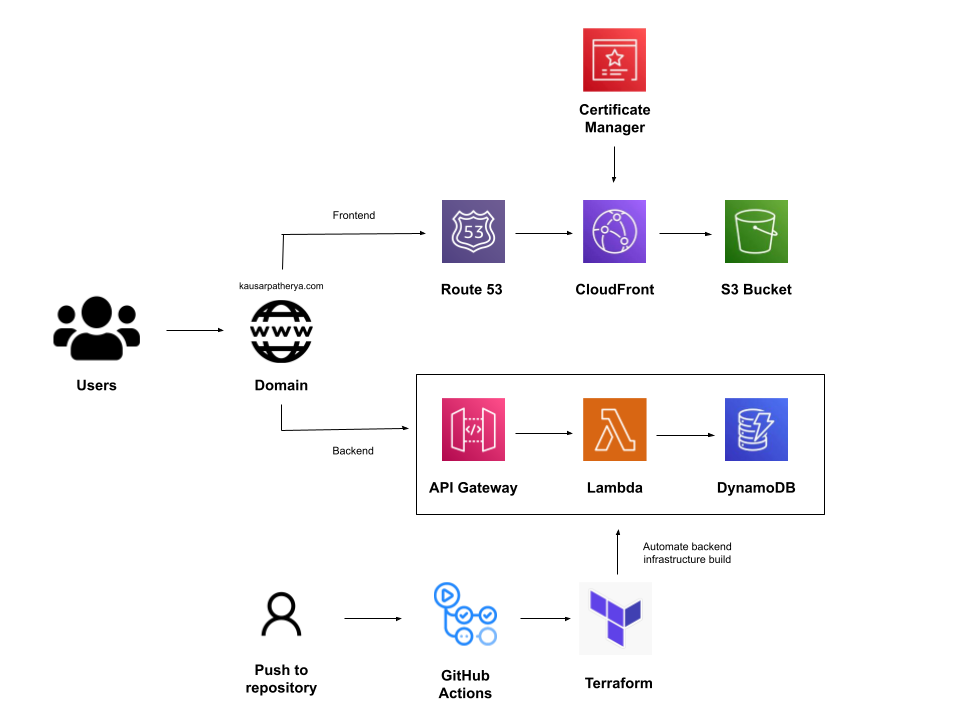
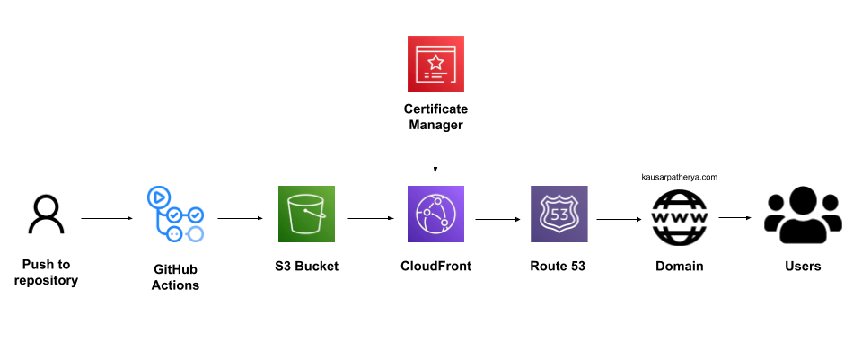

# Frontend Infrastructure of my AWS Resume
## Project introduction

The [AWS Resume Challenge](https://cloudresumechallenge.dev/docs/the-challenge/aws/), created by [Forrest Brazeal](https://www.linkedin.com/in/forrestbrazeal), gave me a hands-on opportunity to build a full-stack web application on AWS. The ask was deceptively simple: build a personal website that would keep a count of the number of times it’s visited. That was until I went over the steps I would have to take to create the website. I created a dedicated frontend and backend, integrated the two, and automated the entire development process using IaC and CI/CD best practices.

## Building the frontend infrastructure

In this README, I will go over how I created the frontend for the AWS Resume Challenge.

The build process consisted of 3 stages:

* Writing HTML, JavaScript, and CSS code to design the frontend. I did the bare minimum here since the focus of this project was not web development.
* Creating a domain name and linking the S3 bucket to it using CloudFront.
* Building a CI/CD pipeline using GitHub actions (.github/workflows). Any change I push to this frontend repository is reflected in near real-time on the live website.

The learning curve here was primarily concentrated within the DNS configuration of the website. After buying the domain name, validating it through the Certificate Manager, and then creating the CloudFront distribution was a lengthy process. In the process, though, I was able to gain a firm understanding of the networking piece of this project.

And [here’s the frontend](https://kausarpatherya.com)!

## Summary

Despite the occasional struggles, I thoroughly enjoyed the entire learning process. I now have a solid foundational understanding of AWS that wouldn’t have been possible to acquire by just passing certifications. I look forward to working on more projects and deepening my understanding.

Thanks for reading! Please find my backend repository linked [here](https://github.com/kpath1999/resume-backend).