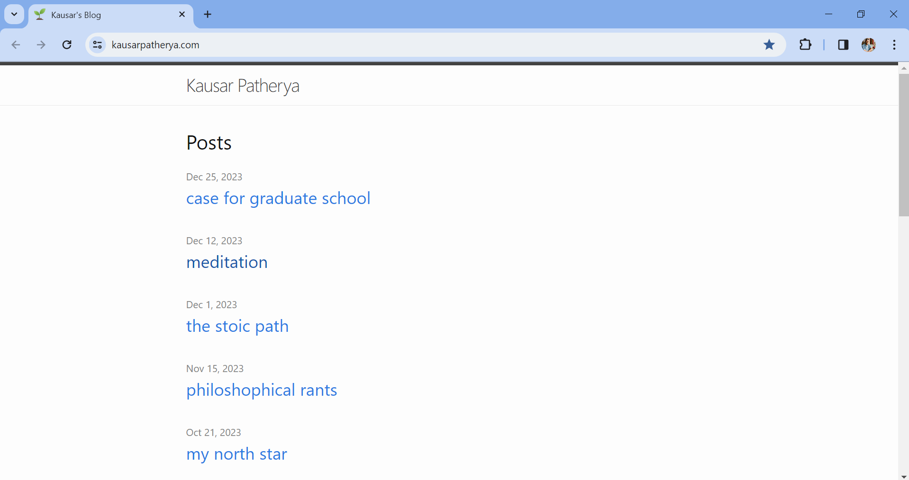

# Creating a Personal Blog using Jekyll

This repository contains the code used to set up my personal blog using Jekyll. Feel free to explore the [blog](https://kausarpatherya.com/)! This is what the landing page looks like:

This project is an ongoing effort, and I will update this README as I add more of my writing to the blog and/or make UI enhancements.

I have included a deep dive on how I went about using Jekyll in [this](https://github.com/kpath1999/kausar-blog-jekyll) repository.
